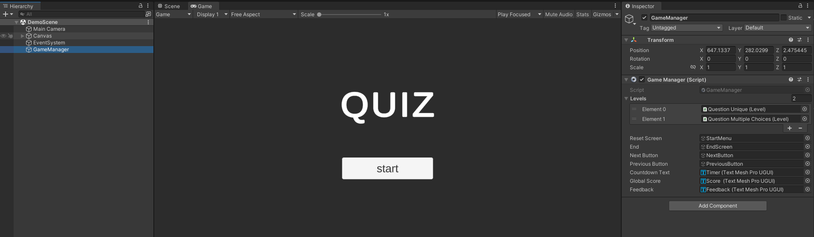

# Inversive SDK Demo Documentation

## Overview

The Inversive SDK sample showcases a demo scene featuring a quiz game layout, providing a fundamental understanding of the SDK's functionalities. This demo scene serves as a starter asset, allowing users to explore and comprehend the key features of the SDK.

## Prerequisites

Before continuing with the sdk implementation demonstration via the demo scene, please make sure you have completed the following steps:  

>[!IMPORTANT]
>
>You must have follow the [Installation Guide](./InstallationGuide.md) and import the sample Inversive SDK Starter Assets.

1. ⚠️ You must have **generated an app id** for your unity project. (see how [Generate an App Id](#generate-app-id))
2. ⚠️ In the experience editor, you must have **loaded** the template json file carried with the Sample (*Inversive SDK/Samples/Demo/ExperienceModelToImport.json*). (see how [Load sample json model](./retrieve-model.md#loading-a-model-via-a-json-file)
3. ⚠️ In the experience editor, **after importing your model** , you must have **Push Model** to update the remote model stored by our platform. (see how [Push Model](./share-model.md#pushing-a-model))

### Usage

To summarize what you need to have done to set up your unity environment : 
You have generated your app id by logging in and and imported your model via json model loading (path), and sent your model information to our platform by pressing `Push Model`. 


>[!WARNING]
>
>If any of these steps are missing, please return to the prerequisites section above.


#### Sample Scene Overview

By importing the sample and opening the demo scene (Inversive SDK/Samples/Demo/Starter Assets/Scenes/DemoScene.unity), here's what you should get:



#### Interacting with SDK Features

The demo unity scene shows you how to use the features offered by the sdk. In particular, it will help you understand how to set up your environment and how to use the methods enabling you to interact with our api. 

##### SDK Methods Implementation

Here are sample implementations of the Inversive SDK methods Init(), StartExperience(), ExecuteAction(), End() and Retry(). They are extracted from the c# script GameManager (Inversive SDK/Samples/Demo/Scripts/GameManager.cs)

###### `Init()`
- This method is called before anything else to retrieve the user session information. 
 here's an example (from Inversive SDK/Samples/Demo/Scripts/GameManager.cs):
    ```csharp
        private void Awake()
        {
            //...
            //Initialize your sdk & retrieve your session informations
            InversiveSdk.Init(this, (x) =>
            {
                Debug.Log($"Initialized & session Id : {x}");
            });
        }
    ```
###### `StartExperience()`
- This method is called to signal the start of the session by the user.
 here's an example (from Inversive SDK/Samples/Demo/Scripts/GameManager.cs):
    ```csharp
        //...
        //Signals that the session has been started
        InversiveSdk.StartExperience(this, (IsSuccess) =>
        {
            Debug.Log($"Started Experience succeed ? : {IsSuccess}");
        });
        //...
    ```

###### `ExecuteAction()`
- This method is called when an action in your experience has been made. 
 here's an example (from Inversive SDK/Samples/Demo/Scripts/GameManager.cs):
    ```csharp
            //...
            //Report that the action has been performed and retrieve the score for that action
            InversiveSdk.ExecuteAction(this, "FirstChapter", actionName, values, (score) =>
            {
                Debug.Log($"Action score : {score}");
            });

            //...
    ```
###### `End()`
- This method is called when the experience has been finished by the user and the session has ended.
 here's an example (from Inversive SDK/Samples/Demo/Scripts/GameManager.cs):
    ```csharp
      
            //...
            //Report session ended
            InversiveSdk.End(this, (IsSuccess) =>
            {
                Debug.Log($"Ended Experience succeed ? : {IsSuccess}");
                if (IsSuccess)
                {
                    GlobalScore.text = $"Score : {InversiveSdk.GetDisplayedGlobalScore()}";
                    Feedback.text = InversiveSdk.GetGlobalScore() >= InversiveSdk.GetWinScore() ? "you succeeded" : "you failed";
                }
            });
            //...
    ```
###### `Retry()`
- This method is called when the session is restarted. 
 here's an example (from Inversive SDK/Samples/Demo/Scripts/GameManager.cs):
    ```csharp
        //..
        //Resets session data to start from the beginning
        InversiveSdk.Retry(this, (x) =>
        {
            Debug.Log($"Retry Experience succeed ? : {x}");
        });
        SceneManager.LoadScene(SceneManager.GetActiveScene().name);
        //..
    ```

### Troubleshooting

Inversive SDK is a new tool, but encountering issues during usage is possible. You can go to the troubleshooting section where there are some common problems you might face and how to resolve them : [Troubleshooting](./troubleshooting.md)


