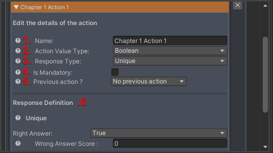

# Experience editor

## Overview

The experience editor window presents a number of features for **editing your experience model**, including the chapter editor , and **collaboration with other developers** with the various tools listed below. 

## Interface overview

Here are its main features:

1. Back to main window (see "Main window (Home)")
2. Load an existing model (see [Load model](./retrieve-model.md))
3. App ID of your experience/project (see [Generate an App ID](./generate-app-id.md))
4. Update model (see [Load a model via app ID](./retrieve-model.md))
5. Undo changes made to your model during your current development session
6. Reset your model
7. Select a rating/score type
8. Edit chapters and actions
9. Export model in json format (see [Exporting a model (Json)](./share-model.md)")
10. Push model (see [Push model](./share-model.md))

### Experience Model

The model corresponds to all the information relating to the chapters and actions you have set up for your experience. 

This information is organized in json format, listing all the chapters and associated actions.

#### Scoring Type

- **Win Score**: Our SDK reports the sum of an experience's points out of 100 points. You are asked to **define a score at which the experience is considered successful**. Once the experience has been completed, it will be considered successful or unsuccessful according to this score.

- **Scoring type**: You can select a format for displaying the final score. Our SDK takes **the total score out of 100 points and automatically converts** it to the selected scoring type. You can choose between the following **4 scoring types**:

    - From 0 to 100
    - From 0 to 10 where the total score is divided by 10
    - From 0 to 20 where the total score is divided by 5
    - A+ to F (see INVERSIVE SDK section in User Guide)

#### Chapter Editor

 The chapter editor manages all the sequences you wish to integrate into your experience model.

##### Chapter

The chaptering enabled by our SDK is a "model of drawers". At the top of this hierarchy is the model (see [Experience Model](#experience-model)), which contains a list of chapters, which in turn contain a list of actions (see [Action](#action)).

A chapter is made up of several properties:

1. **Name**: This is used to identify the chapter. In particular, it is used to execute code functions relating to this chapter.
2. **Order**: This defines the order in which chapters are executed in relation to each other. For example, the chapter "highest" in the list is not necessarily the first chapter in the experiment.
3. **List of actions**: These are the actions present in this chapter.

You can add a chapter by clicking on "+ Add Chapter", delete a chapter by clicking on the cross to the right of its name, or delete all the chapters by clicking on "- Remove All".

##### Action

An action is the heart of the chaptering model. Each action has a score associated with it, and the sum of these scores forms the global score (see "Scoring Type").

An action is made up of several properties:

1. **Name**: Used to identify the action. In particular, it is used to execute code functions relating to this action.
2. **Value type**: This is the type of value expected to determine the score (Boolean value, string, float or integer).
3. **Response type** : This is the format of the response, i.e. a single value (*Unique*), multiple values, an interval between 2 values, and one or more levels of values (*Rating Level*).
4. **Mandatory**: Defines whether the action must be performed by the user or whether it can be skipped.
5. A dependency on a **previous action**: Certain actions cannot be executed until a previous action in the experience has been executed.
6. An **action definition**: This is the field in the form where you can define **the expected value(s) and the scores associated with this/these value(s)**.

You can add an action by clicking on "+ Add Action", delete an action by clicking on the cross to the right of its name, or delete all the actions by clicking on "- Remove All".

###### Value types

- **Boolean**: This value type can only be associated with a **Unique** response type. (see [Response type](#response-types))
- **String**: This type of value can only be associated with a **Unique** response type or with **Multiple Values** (see "Response type"). (see [Response type](#response-types))
- **Float**: This type of value can only be associated with a **Unique** type of response, with **Multiple Values**, with an **Interval**, or with **Rating Levels**. (see [Response type](#response-types))
- **Integer**: This value type can be associated with a **Unique** response type, with **Multiple Values** , with an **Interval**, or with **Rating Levels** . (see [Response type](#response-types))

###### Response types

- **Unique Response**: For this type of response, only one response is expected. If the response is correct, the score for the correct response must be 100 points. However, it is possible to choose a score for the wrong response (0 by default).

- **Multiple Values Response**: For this type of response, several responses are expected. The sum of the scores for each response is calculated out of 100 points and constitutes the final score for this action.

- **Interval Response**: For this type of response, a single value (a number) is expected. The correct response lies between a minimum and a maximum value. The expected value corresponds to a score of 100 points, while values above the minimum and maximum values correspond to a score of 0 points. For any value between the expected value and the limit values, a calculation is made to automatically determine the number of points allocated to the action. In fact, the closer the value is to the expected value, the closer the score will be to 100.

- In our example, the action shown opposite represents a nail to be driven at a certain angle to the support. A perfect score corresponds to 90°, i.e. 100 points for the user. If my nail is driven at 65.5° or less, the user will score 0 points. Similarly, a value of 115.5° or more represents a score of 0 points. If the user drives his nail at 80°, he will have a score of 59 points. This score corresponds to the ratio between the perfect value and the minimum value (rounded to the nearest integer).

- **Rating Levels Response**: For this type of response, a number is expected. The levels allow different scores to be associated with different intervals. Any response within the defined interval will give the associated score. It is possible to assign several levels to the action, each with an associated score. Unlike the "Interval" response type, any response within the limit of the level will give the associated score and any response outside the level will give a score of 0 points.

- To take the example of the nail to be driven in as straight as possible, I can set my levels to estimate that between 85 and 95, the user will have a score of 100 (maximum score). I can also set other levels to choose a score associated with other responses. Here, between 65.5 and 85 and between 95 and 115.5, the user will have a score of 50/100. Any other response will represent a score of 0 points.

>[!NOTE]
>
>To sum up, an action is essentially a type of expected value coupled with a particular type of response.

