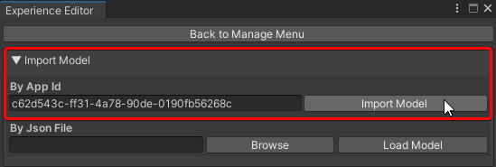
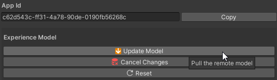
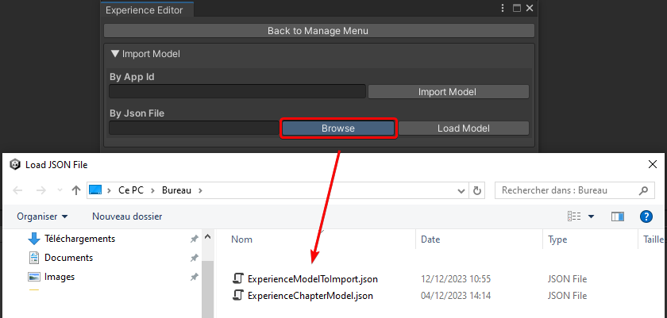
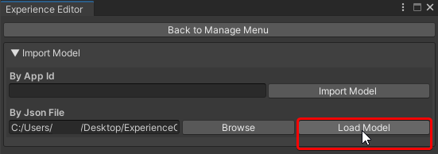

# Load a model

>[!IMPORTANT]
>
>Mandatory step to use Inversive Sdk.

## Overview

One of the main features of Inversive Sdk is the ability to **retrieve a model** from other developers. This is an important feature for setting up the sdk in unity. 

## How ?
--- 

### Load a model via app ID

If you're working on a project using the INVERSIVE SDK and would like to retrieve a model generated for your experience, you can retrieve a chaptering model via the app ID. To do this, go to the chapter editor (see [Experience Editor](./experience-editor.md)) and click on the **Import Model** drop-down menu, then enter the app ID in the field provided. You can also enter the app ID in the text field provided and click on **Update Model** to update the model with the latest pushed version (see [Pushing a model](./share-model.md)).

>[!WARNING]
>
>The retrieved model will overwrite your current model.

**Option 1**

**Option 2**

>[!IMPORTANT]
>
>If you have several user profiles available on the platform, you must create/publish your experience with the profile that generated the app ID to retrieve your model from the INVERSIVE platform.

### Loading a model via a json file

You can retrieve an experience model by loading an existing json file (see [Exporting a model (Json)](./share-model.md)). To do this, go to the **Experience Editor** and click on the **Import Model** drop-down menu. In the **By Json File** section, click on **Browse** and enter your file. 

Finally, click on **Load Model** to load your experience model.

>[!WARNING]
>
>The loaded model will replace your current one. If you want to synchronize it with your app ID, don't forget to push your model.

